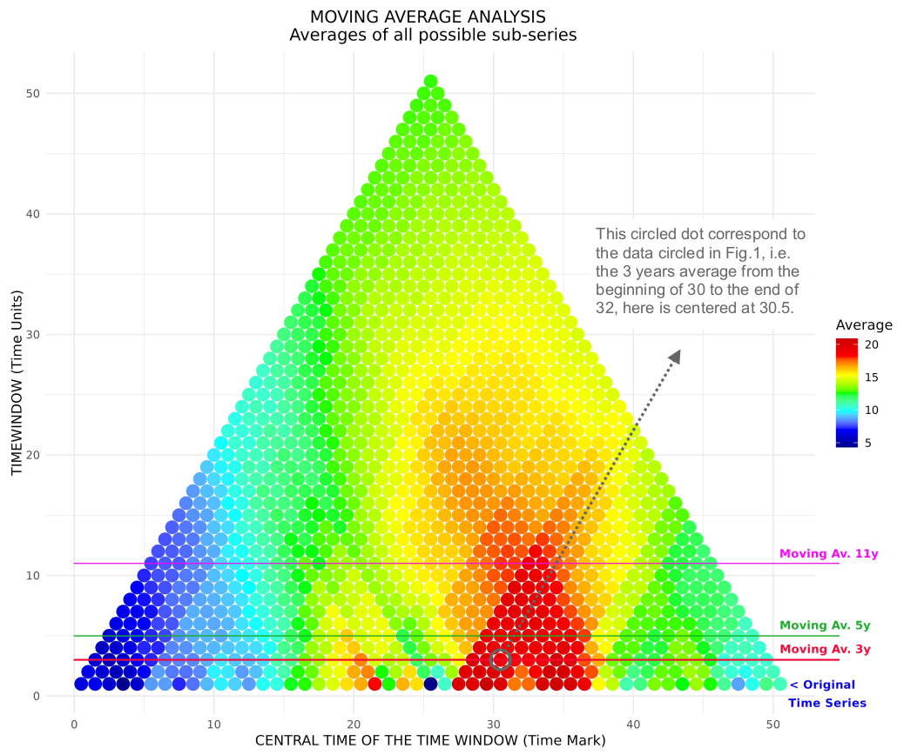
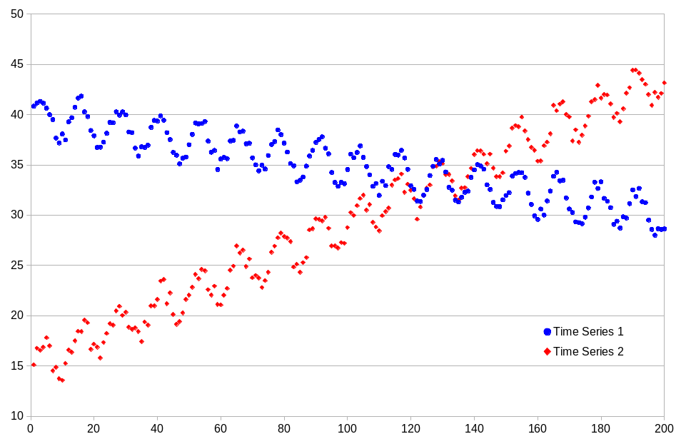

# TimeHiVE: Hierarchical Moving-Window Time Series Analysis Toolkit

<!-- badges: start -->
[](https://www.gnu.org/licenses/gpl-3.0)
[](https://doi.org/10.5281/zenodo.15697261)
<!-- badges: end -->

## Overview

TimeHiVE provides efficient R functions for hierarchical moving-window analysis of coupled time series data. The toolkit implements:

- Parallel computation of Pearson and Mann-Kendall correlations
- Optimized O(n log n) implementations of statistical tests
- Customizable visualization of time-dependent relationships
- Statistical significance testing with adjustable thresholds

The software package here proposed allows to perform analyses on time series avoiding the arbitrary choice of the time window and allowing to appreciate the whole spectrum of possible results offered by this kind of statistical tools.


*Figure 1: Different Moving Average vs Original Syntetic Time Series. Color scale on y-axis is meant only to match colors in Fig. 2*


*Figure 2: Representation of all the possible moving averages for the Original Syntetic Time Series, moving averages analyses represented in Fig. 1 are highlighted with comments on the results.*


*Figure 3: Representation of two Time Series positively correlated for short periods but negatively correlated for long periods. The series are built as: `TS1 = 40 + 2*sin(t/2) - t/20 - rand(-2/3, 2/3)` and `TS2 = 15 + 2*sin(t/2) + t/7 - rand(-2/3, 2/3)`. The sine component creates short-term positive correlation, while the `t/n` terms drive long-term negative correlation.*


*Figure 4: Here we show the Moving Correlation Analysis for the coupled Time Series represented in Fig. 4, the first row shows the results for Pearson’s correlation coefficient (Top Left) and relative p-values (Top Right), the second row shows the same analysis with MK’s correlation coefficients (Bottom Left) and relative p-values (Bottom Right). The inversion of the correlation between short and long period of analysis is quite clear.*

FIRST ROW: Pearson’s correlation coefficient (Top Left) and relative p-values (Top Right).
SECOND ROW: same analysis with MK’s correlation coefficientes (Bottom Left) and relative p-values (Bottom Right). The inversion of the correlation between short and long period of analysis is quite clear.

## Installation

You can install the development version from GitHub with:

```r
# install.packages("remotes")
remotes::install_github("Ouroboro/TimeHiVE")
```

## Usage

### Basic Example
```r
library(TimeHiVE)

# Generate example data
set.seed(123)
series1 <- sin(seq(0, 4*pi, length.out = 200)) + rnorm(200, sd = 0.2)
series2 <- cos(seq(0, 4*pi, length.out = 200)) + rnorm(200, sd = 0.3)

# Perform analysis
results <- TH_coupled(
  series1 = series1,
  series2 = series2,
  m = 2,
  s = 6,
  alpha = 0.05,
  mode = "both"
)

# Visualize results
TH_plotc(results, mask = TRUE, mode = "both")
```

### Advanced Usage

For functions `TH_plots` and `TH_plotc`, you can use significance values to mask the output of statistical tests depending on the value you chose previously.

```
results2 <- TH_coupled(series1, series2)

Fig5 <- "Fig5.png"
Fig6 <- "Fig6.png"
p <- TH_plotc(results2, output_file = Fig5)
p <- TH_plotc(results2, output_file = Fig6, mask = TRUE)
```


*Output for Fig. 5 unmasked.*


*Output for Fig. 6 masked.*

If the moving-window statistical analyses proposed by the previous functions are not sufficient, functions `TH_tweak()` and `TH_plott()` allow you to use custom functions and possibly customize the color scales and tile intervals during the display phase. An exhaustive example follows shortly.

```
### START Customized Functions ###

harmean_fun <- function(series) {
  series <- series[!is.na(series)]
  n <- length(series)
  sol <- n / sum(1/series, na.rm = TRUE)
  return(sol)
}

mean_fun <- function(x) mean(x)

diffmean_fun <- function(series) {
  series <- series[!is.na(series)]
  x <- harmean_fun(series)
  y <- mean_fun(series)
  sol <- x-y
  return(sol)
}

skew_fun <- function(series) {
  series <- series[!is.na(series)]
  n <- length(series)
  avg <- mean(series)
  sd_camp <- sd(series)
  sol <- sum((series - avg)^3 / (sd_camp^3)) / n
  return(sol)
}

### END Customized Functions ###

results <- TH_tweak(
  harmean_fun,
  mean_fun,
  diffmean_fun,
  skew_fun,
  series = list(data),
  param = 0.05
)

### START Customized Color Palette ###

skew = {
  neg <- colorRampPalette(c("green4", "green"))(33)
  pos <- colorRampPalette(c("magenta", "magenta4"))(33)
  c(neg, "white", pos)
}

### END Customized Color Palette ###

Fig7 <- "Fig7.png"
p <- TH_plott(results, output_file = Fig7, 
              colorscales = list(
                "avg",
                "avg",
                c("magenta", "purple", "blue", "cyan", "white"),
                skew),
              colorlimits = list(
                c(0, 35),
                c(0, 35),
                NULL,
                NULL))
```


*Output for Fig. 7 single series tweak.*

```
### START Customized Functions ###

pearson_fun <- function(x, y) cor.test(x, y, method = "pearson")$estimate

diffmax_fun <- function(serie1, serie2, na.rm = TRUE) {
  max1 <- sum(serie1, na.rm = na.rm)
  max2 <- sum(serie2, na.rm = na.rm)
  sol <- (max1-max2)
  return(sol)
}

sqrmean_fun <- function(serie1, serie2, na.rm = TRUE) {
  x <- sum(serie1, na.rm = na.rm)
  y <- sum(serie2, na.rm = na.rm)
  sol <- sqrt(sqrt((x*y)^4))
  return(sol)
}

### END Customized Functions ###

results <- TH_tweak(
  pearson_fun,
  diffmax_fun,
  sqrmean_fun,
  series = list(sdata, sdata2),
  param = 0.05
)

Fig8 <- "Fig8.png"
p <- TH_plott(results, output_file = Fig8, 
colorscales = list(c("blue", "white", "red"),
                   c("green", "yellow", "purple"),
                   "avg"))

```


*Output for Fig. 8 coupled series tweak.*


### Main Functions

- `TH_single()`: Perform hierarchical moving-window analysis for single series
- `TH_coupled()`: Perform hierarchical moving-window analysis for coupled series
- `TH_tweak()`: Perform customized hierarchical moving-window analysis for coupled or single series
- `TH_plots()`: Visualize analysis results from `TH_single()`
- `TH_plotc()`: Visualize analysis results from `TH_coupled()`
- `TH_plott()`: Visualize analysis results from `TH_tweak()`, no masking.
- `TH_MK_Trend()`: Mann-Kendall trend test
- `TH_MK_Corr()`: Mann-Kendall correlation test


## Documentation

For detailed documentation see:

```r
?TH_single
?TH_coupled
?TH_tweak
?TH_plots
?TH_plotc
?TH_plott
?TH_MK_Trend
?TH_MK_Corr
```

## Contributing

Contributions are welcome! Please follow these steps:

1. Fork the repository
2. Create your feature branch (`git checkout -b feature/your-feature`)
3. Commit your changes (`git commit -am 'Add some feature'`)
4. Push to the branch (`git push origin feature/your-feature`)
5. Open a Pull Request

## License

This package is licensed under the GNU General Public License v3.0 (GPL-3.0). See the [LICENSE](LICENSE) file for details.

## Contact

For questions or issues, please contact:

Vladimiro Andrea Boselli  
Email: boselli.v@irea.cnr.it  
GitHub: [@Ouroboro](https://github.com/Ouroboro)
