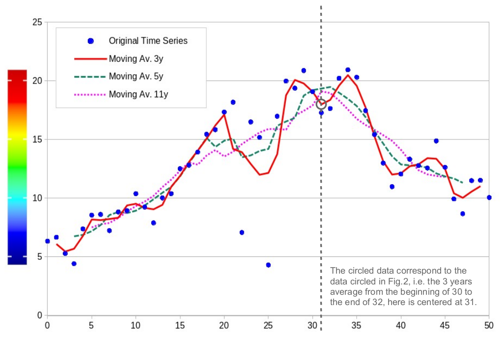
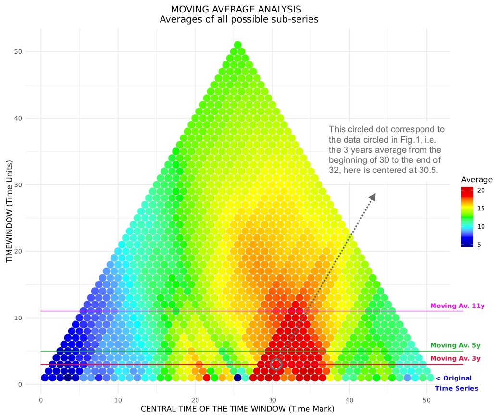
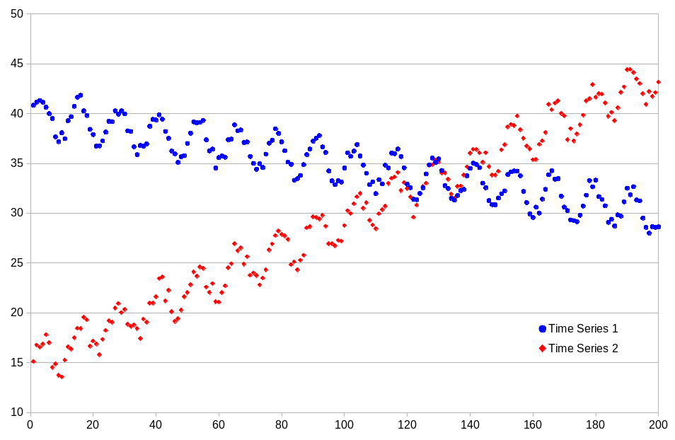

# Summary

TimeHiVE by @Bos2025 is an R package designed for hierarchical moving-window statistical analysis of time series data. The package addresses a fundamental challenge in time series analysis: the selection of appropriate window sizes for moving-window calculations. Traditional moving-window approaches require users to specify a fixed window size, which can obscure important patterns if chosen inappropriately. TimeHiVE eliminates this constraint by systematically computing statistics across all possible window sizes, enabling researchers to explore the full spectrum of temporal patterns in their data.

The package provides implementations for both single time series analysis (including means, trends, and custom statistics) and coupled time series analysis (including Pearson and Mann-Kendall correlations). TimeHiVE features Mann-Kendall statistics algorithms with O(n log n) time complexity, parallel computation capabilities for unix-based systems, and customisable visualization tools. These features make it particularly valuable for environmental and climate research, where understanding phenomena across multiple timescales is essential.

# Statement of need

Moving-window statistical analysis is a fundamental technique in time series analysis, used to study the evolution of data over time in a dynamic and localized manner. This approach involves calculating statistics on subsets of consecutive data points that progressively move along the series. The technique helps identify localized trends, seasonality, and anomalies while reducing the impact of random fluctuations, highlighting meaningful patterns.

The challenge of selecting an optimal window size is well-documented in time series literature. A window that is too large may obscure important details, while one that is too narrow may be overly sensitive to noise. This problem is particularly relevant in climate science, where researchers need to examine phenomena across multiple timescales. Previous work by Brunetti and colleagues [@Bru2006; @Bru2009] demonstrated the value of hierarchical moving-window approaches for climate data analysis, but implementation required custom code.

TimeHiVE makes this analytical approach accessible to a broader research community by providing a well-documented, efficient implementation in R. The package offers several advantages over existing solutions:

1. It eliminates the need for *a priori* window size selection
2. It provides optimized implementations of common statistical tests
3. It supports both single and coupled time series analysis
4. It offers flexible visualization capabilities
5. It allows for custom statistical functions through its extensible architecture

The package is particularly valuable for environmental researchers, climate scientists, and anyone working with temporal data where patterns may manifest across different timescales. By providing a comprehensive toolkit for hierarchical moving-window analysis, TimeHiVE enables more thorough exploratory data analysis and more robust pattern detection in time series data.

TimeHiVE implements two main analytical functions: `TH_single()` for single time series analysis and `TH_coupled()` for analyzing relationships between two time series. Additionally, the `TH_tweak()` function allows users to implement custom statistical functions, making the package extensible to specialized analytical needs.

The package includes comprehensive visualization functions (`TH_plots()`, `TH_plotc()`, and `TH_plott()`) that generate heatmap-style representations of results, with time on the x-axis and window size on the y-axis. This visualization approach, inspired by Brunetti et al. [@Bru2006; @Bru2009], enables intuitive interpretation of patterns across timescales. A recent application has been carried out on precipitation time series derived from FAIR datasets provided by the eLTER Research Infrastructure
[eLTER-RI](https://elter-ri.eu/), offering a first example of their potential to support preliminary data exploration and quality assessment within eLTER [@Bos2025b].

# State of the field

The R ecosystem offers a rich variety of packages for moving‑window (rolling) time series analysis. The **zoo** package provides `rollapply()`, a general‑purpose rolling function, together with specialised routines such as `rollmean()` [@Zei2005]. **slider** offers type‑stable sliding window functions that operate on any R data type, with support for expanding and cumulative windows [@Vau2021]. **runner** is a lightweight library that enables the application of any R function to rolling windows, with full control over window size, lag, and irregular time indices [@Gur2024]. For high‑performance computing, **RcppRoll** implements fast rolling operations (mean, median, sum, standard deviation) using C++ [@Ush2024].

For trend detection, the **Kendall** package implements the Mann‑Kendall trend test and Kendall rank correlation [@Mcl2011]. The **trend** package provides a broader suite of non‑parametric trend tests and change‑point detection methods, including several variants of the Mann‑Kendall test [@Poh2023].

In the domain of rolling correlation, **NonParRolCor** estimates rolling window correlations between two time series, addressing the multiple testing issue via Monte Carlo simulations [@Pol2023]. **RolWinMulCor** extends this concept to the multivariate case and can produce heatmap visualisations for a band of window lengths [@Pol2020].

Despite the wide availability of these tools, none of them implements a truly **hierarchical** moving‑window analysis that systematically explores **all possible window sizes**. Most packages require the user to specify a single window length (or a small number of lengths) in advance, which forces researchers to commit to a particular temporal scale before analysis. This is a recognised limitation: the choice of window size has a profound effect on the patterns detected, and an inappropriate choice can obscure important signals or introduce spurious ones [@Bru2006; @Bru2009; @Erm2024].

While existing packages excel at rolling windows with a fixed size or a small set of sizes, none implements an exhaustive, automated hierarchical search across all possible window lengths. This forces the user to commit to a scale *a priori*, potentially missing multi‑scale patterns. **TimeHiVE** uniquely addresses this gap by providing a comprehensive, optimised framework for full‑spectrum, scale‑agnostic exploration, computing statistics for every window length from 1 to N and producing a complete two‑dimensional output space (time × window size). This exhaustive exploration is made feasible through algorithmic optimisations (incremental updates, O(N log N) Mann‑Kendall routines) and parallel computation.

# Research impact statement

TimeHiVE has been adopted for pre‑analysis data exploration within the eLTER Research Infrastructure (eLTER‑RI), enabling rapid quality and pattern detection across all window sizes without a priori parameter selection [@Bos2025b]. Peer‑reviewed applications demonstrated its utility for quality assessment of daily precipitation series from eLTER sites (Aigüestortes, Spain; Svartberget, Sweden) by revealing seasonal patterns and detecting post‑2010 anomalies [@Bos2025b]. The package's heatmap visualisation (`TH_plots()`, `TH_plotc()`, `TH_plott()`) makes multi‑scale statistical results interpretable to advanced citizen scientists, lowering barriers to exploratory analysis. The extensible `TH_tweak()` mechanism allows custom statistics integration into participatory monitoring workflows.

# Usage examples

In this section we give a visual example for a single time series and a visual example for coupled time series

*Figure 1: Different Moving Average vs Original Syntetic Time Series. Color scale on y-axis is meant only to match colors in Fig. 2*

*Figure 2: Representation of all the possible moving averages for the Original Syntetic Time Series, moving average analyses represented in Fig. 1 are highlighted with comments on the results.*

*Figure 3: Representation of two Time Series positively correlated for short periods but negatively correlated for long periods. The series are built as: `TS1 = 40 + 2*sin(t/2) - t/20 - rand(-2/3, 2/3)` and `TS2 = 15 + 2*sin(t/2) + t/7 - rand(-2/3, 2/3)`. The sine component creates short-term positive correlation, while the `t/n` terms drive long-term negative correlation.*

*Figure 4: Here we show the Moving Correlation Analysis for the coupled Time Series represented in Fig. 3, the first row shows the results for Pearson's correlation coefficient (Top Left) and relative p-values (Top Right), the second row shows the same analysis with MK's correlation coefficients (Bottom Left) and relative p-values (Bottom Right). The inversion of the correlation between short and long period of analysis is quite clear.*

# Software design

TimeHiVE adopts a **hierarchical moving‑window** design: instead of a single window size, it computes statistics for **every possible window length** (from 1 to $N$), creating a 2D output space (time vs. window size). This exhaustive approach eliminates the need for *a priori* window selection.

## Key design choices

1. **Incremental computation** – For mean and variance, windows are updated in ($O(1)$) by adding one new observation and removing the oldest. Mann‑Kendall (MK) trend and correlation use $O(N \log N)$ algorithms [@Kni1966; @Chr2005] based on precomputed ranks.

2. **Parallel execution** – On Unix‑like systems, `parallel::mclapply()` distributes work across window sizes, scaling almost linearly with CPU cores. Windows systems fall back to sequential execution.

3. **Extensibility** – `TH_tweak()` allows users to supply custom R functions (vector → scalar) that are applied to every window, reusing the hierarchical framework and parallel backend.

4. **Visualisation‑first output** – Results are returned as matrices (time × window size) and directly consumed by `TH_plots()`, `TH_plotc()`, and `TH_plott()`, which produce heatmaps with time on the x‑axis and window size on the y‑axis [@Bru2006; @Bru2009].

5. **Robustness** – Unit tests (`testthat`), input validation, and reproducible examples ensure reliability.

## Performance note

On an 8‑core workstation, a full hierarchical MK trend for a 1000‑point series takes ≈12 seconds (coupled analysis ≈22 seconds). Performance scales quadratically with series length; parallelisation is recommended for >5000 points.

# AI usage disclosure

The authors used DeepSeek to assess code consistency and identify redundancies during optimisation. All AI‑generated suggestions were reviewed, tested, and validated by human authors. The original core algorithms and code architecture were written entirely by humans.

# Acknowledgements

This work has been partially funded from the Horizon Europe eLTER EnRich project Grant Agreement No. 101131751 (DOI: 10.3030/101131751)

# References
